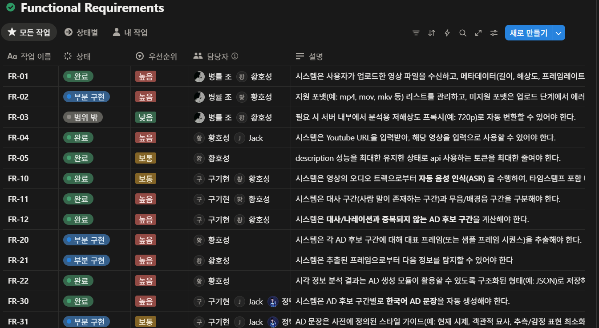
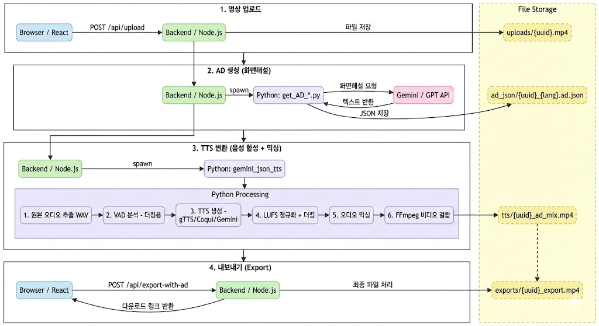

# 나우유씨미v2

## Nowyouseeme – 한국어 자동 화면 해설(AD) 웹 서비스

- **기간**: 2025.11.03 ~ 2025.12.08
- **인원**: 5명 팀 프로젝트
- **역할**: 팀 PM, LLM·멀티모달 파이프라인 설계, 백엔드/프론트엔드 핵심 구현
- **타깃 포지션**: NLP 엔지니어, 멀티모달 엔지니어, LLM 엔지니어

---

### Highlight

- 영상 입력 → AD 생성 → TTS → AD 삽입까지 **엔드투엔드 자동화 파이프라인 + 웹 서비스**를 5주 안에 구현
- 최근 대사·이전 AD·키프레임·무음 길이를 묶는 **컨텍스트 윈도우 + LLM 프롬프트 설계**로, 단순 캡셔닝 대비 AD 자연스러움·연속성 개선
- Gemini / GPT / Cookie(로컬 VL+LLM) 파이프라인을 **단일 인터페이스로 통합**해, 5분 영상 기준 **1분~20분** 처리 속도 및 비용·품질 트레이드오프 분석

---

### 결과 요약

- 약 **30편**의 영상으로 파이프라인 테스트
- 5분짜리 영상 기준 처리 시간
    - **Gemini**: 약 1분
    - **GPT**: 약 5분
    - **Cookie(로컬 VL+LLM)**: 약 20분
- Silero VAD + Whisper + 타임라인 후처리로, **AD가 원본 대사를 덮지 않는 타임라인** 확보
- 컨텍스트 윈도우 도입 후, 인물·행동의 **연속성·일관성**이 개선된 AD 문장 생성 확인
- Reference AD 기준 유의미한 성능을 확인
    
    
    |  | Cookie | Jack | Gemini | GPT |
    | --- | --- | --- | --- | --- |
    | CIDEr  | 0.0000 | 0.0713 | **0.3033** | 0.0104 |
    | METEOR | 0.1976 | 0.1840 | 0.2529 | 0.2333 |
    | BERTScore  | 0.8329 | 0.8814 | **0.8864** | 0.8675 |
    | CRITIC  | 0.3834 | **0.4872** | 0.0909 | 0.3569 |
    | LLM-Eval  | 2.0000 | 1.9231 | **2.25** | 1.9565 |

---

## 1. 프로젝트 개요

Nowyouseeme는 시각장애인을 위해, **영상에 한국어 화면 해설(Audio Description)을 자동 생성·삽입**하는 웹 서비스다.

사용자는 웹에서 영상을 업로드하거나 YouTube URL을 입력하면, 시스템은:

1. 음성 트랙에서 **대사/무음/배경음 구간을 분석**하고
2. 무음·의미 단위로 **AD 후보 청크를 계산**하며
3. 각 청크에 대해 **LLM으로 한국어 AD 문장을 생성**하고
4. **TTS로 음성을 합성해 AD를 타임라인에 삽입**한 최종 영상을 출력한다.

목표는 “연구용 모델 실험”이 아니라 **실제로 시연 가능한 엔드투엔드 MVP**까지 만드는 것이었다.

---

## 2. 시스템 아키텍처

### 2.1 클라이언트 (React · TypeScript)

- 로컬 영상 업로드 / YouTube URL 입력 UI
- 업로드·처리 상태 표시(대기/진행/완료)
- 결과 영상 재생, AD 온·오프 제어
- 이후 에디터(스크립트 수정/재생)로 확장 가능한 레이아웃 설계

### 2.2 서버 (Node.js · Express · Supabase)

- Multer 기반 대용량 파일 업로드 처리
- 작업(Job) 생성, 상태 관리, 결과 파일 경로 관리
- Python 인퍼런스 스크립트 실행 래퍼 및 에러 핸들링
- Supabase Auth로 사용자 관리 및 추후 크레딧 기반 과금 구조까지 고려

### 2.3 AI 파이프라인 (Python)

1. **탐지(Detection)**
    - Silero VAD로 발화/무음 구간 분리
    - Whisper로 ASR 수행, **대사 구간을 보호해야 할 영역**으로 마킹
    - SigLip 임베딩 + 코사인 유사도로 인접 구간을 묶어 **의미 단위 청크** 생성
    - 대사·나레이션과 겹치지 않는 **AD 후보 구간** 계산
2. **이해(Understanding)**
    - 각 청크에서 대표 프레임(키프레임) 추출
    - VL 모델로 시각 정보를 요약하고,
        - 최근 60초 대사(최대 4문장)
        - 직전 2개 AD
        - 현재 청크 키프레임 요약
        - AD 후보 구간 길이(초)
            
            를 묶어서 **컨텍스트 패키지** 구성
            
3. **생성(Generation)**
    - 선택된 모델(Gemini / GPT / Cookie / Jack)에 컨텍스트 패키지 전달
    - AD 도메인 가이드 기반 프롬프트:
        - 현재 시제, 객관적 서술
        - 감정·의도 추측 금지
        - 대사와 의미 중복 금지
        - 문장 수/길이 및 무음 길이 제약 명시
    - 생성 결과가 무음 길이를 초과하면, Llama/Gemini 요약 프롬프트로 **의미 유지·길이 축소**
4. **합성(Synthesis)**
    - gTTS / Coqui XTTS / Gemini TTS로 AD 음성 생성
    - FFmpeg + pydub로 원본 오디오 위에 AD 트랙을 삽입하고 길이·위상 정렬
    - 세그먼트 단위로 **대사/AD 오버랩 여부를 검사**해 최종 mp4 출력

### 2.4 배포

- Front / Back / Inference 컨테이너를 Docker로 분리
- Docker Compose로 개발·테스트 환경 구성
- Nginx 리버스 프록시로 단일 도메인/포트로 서비스 노출

---

## 3. LLM 프롬프트 & 맥락 설계

### 3.1 문제 정의

- 고정 윈도우 + 단일 프레임 기반 설명만 사용할 경우:
    - 인물·행동의 **연속성이 끊기고**,
    - AD가 단순 이미지 캡션 수준에서 벗어나지 못하는 문제가 발생.
- AD는 **앞뒤 장면과 대사의 맥락**을 반영해야 자연스럽게 들리지만,
    
    LLM에 아무 맥락 없이 현재 프레임만 던지면 이 부분이 깨진다.
    

### 3.2 컨텍스트 윈도우 설계

- 논문 리서치를 바탕으로, 각 청크에 대해 아래 정보를 하나의 패키지로 구성:
    - 최근 60초 대사(최대 4문장)
    - 직전 2개 AD (연속성 유지, 중복 방지 목적)
    - 현재 청크의 키프레임 요약
    - 현재 청크의 AD 후보 구간 길이(초)
- 이 컨텍스트 패키지를 Gemini / GPT / Cookie / Jack에 **공통 입력 포맷**으로 사용
- 결과적으로 LLM이 **장면의 앞뒤 흐름과 시간 제약을 동시에 고려**하도록 유도

### 3.3 프롬프트 템플릿 고도화

- AD 도메인 가이드를 반영한 템플릿 설계:
    - “현재 시제, 객관적 사실만 서술, 감정·의도 추측 금지, 한 세그먼트당 0~2문장”을 명시
    - “지정된 무음 길이 안에서 말할 수 있도록 요약하라”는 형태로 시간 제약을 직접 표기
- Gemini·GPT 각각의 특성을 고려해, 예시·규칙·금지 패턴 비율을 조정하며 수십 회 실험
- 컨텍스트 미사용 버전 대비,
    - 인물 호칭 및 행동 서술의 **끊김 현상 감소**,
    - 같은 인물·장면에 대한 **서술 일관성**이 개선된 것을 팀 내부 블라인드 비교로 확인

### 3.4 멀티모델 파이프라인 통합

- Cookie(로컬 Qwen-VL + Llama), Gemini, GPT, Jack(Gemini 멀티스테이지)를
    
    모두 `input: 청크 JSON → output: AD JSON` 포맷으로 통일
    
- Node 서버에서는 모델 타입만 스위칭하도록 설계
- 같은 입력에 대해 모델별 **품질·속도·비용 트레이드오프**를 실험·비교할 수 있는 환경 구축

---

## 4. 구현 상세 및 기여

### 4.1 역할 요약

- 팀 PM: 요구사항 정의, 일정·우선순위 관리, 통합 아키텍처 설계
- 백엔드/프론트엔드: 업로드 → 인퍼런스 → 결과 반환까지 핵심 플로우 구현
- LLM/멀티모달: 컨텍스트 윈도우 설계, 프롬프트 템플릿 고도화, 멀티모델 통합

### 4.2 요구사항 정의 및 프로젝트 관리

- Notion **Functional Requirements 보드(FR-01 ~ FR-61)** 설계
    - 필수 기능: 업로드, YouTube 입력, ASR/VAD, AD 후보 구간 계산, AD 생성, TTS, 최종 영상 Export
    - 고급 기능: 대표 프레임 추출, 시각 정보 구조화, AD 스타일 가이드 반영, 유저 피드백 기능 등
- 각 FR에 **우선순위·담당자·상태(완료/부분 구현/미구현)**를 할당해 스코프 관리
- 5주 안에 필수 FR은 완료 상태로, 고급 기능은 부분 구현/후순위로 조정해 **발표 가능한 MVP** 확보

### 4.3 백엔드 / 프론트엔드 구현

- 백엔드
    - 영상 업로드 API, Job 생성·상태 조회, 결과 다운로드 API 구현
    - Python 인퍼런스 스크립트 호출 래퍼 작성(로그, 에러 핸들링 포함)
- 프론트엔드
    - 업로드·진행 상태 표시 화면, 결과 재생 화면 구현
    - 이후 스크립트 편집/타임라인 UI로 확장 가능한 구조로 컴포넌트 분리

---

## 5. 성능 및 실험

- **테스트 규모**: 약 30편의 영상(장르·구성 다양한 샘플)
- **5분짜리 영상 기준 처리 시간**
    - Gemini: ~1분
    - GPT: ~5분
    - Cookie(로컬 VL+LLM): ~20분
- **타임라인 품질**
    - VAD 기반 무음 구간 + 대사 보호 로직으로
        
        → AD가 대사·중요 효과음을 덮지 않는 타임라인 확보
        
- **정성 결과**
    - 컨텍스트 윈도우 도입 전·후 AD를 비교했을 때,
        
        팀 내부 평가에서 **맥락 반영 버전이 더 자연스럽다는 피드백** 확보
        

---

## 6. 한계 및 향후 계획

- 액션/공포 등 **컷 전환이 빠른 장르**에서 청크 분할·키프레임 선택 난이도 상승
- 감정/의도 추측을 제한해 사실성은 확보했지만, **사람 성우 AD 대비 다소 건조한 표현**
- 현재는 에피소드 단위 맥락까지만 커버, **시리즈·세계관 전체의 일관성**은 미지원

**향후 개선 방향**

- RAG 기반 인물·장소 지식 베이스 구축 → 캐릭터/지명·관계 정보 **일관성 유지**
- 사용자 피드백(수정 로그, 별점)을 활용한 **LLMOps 파이프라인** 설계
- 영어·일본어 등 다국어 확장 및 자막·더빙 연계로 **글로벌 접근성 서비스**로 확장

‘

## 7. 부록

1. Notion FR 보드
    
    
    

1. 시스템 아키텍쳐
    
    
    

1. AD.json 샘플
    
    ```json
    {
      "audio_descriptions": [
        {
          "start_time": "0:11.5",
          "end_time": "0:14.2",
          "duration_sec": 2.7,
          "description": "남자2가 사무실을 둘러보고 남자1은 한숨을 쉰다."
        },
        {
          "start_time": "0:16.5",
          "end_time": "0:26.8",
          "duration_sec": 10.3,
          "description": "남자2가 의자를 만져본 뒤 책상 위의 액자를 집어 든다. 사진 속에는 남자1과 아버지가 있다."
        },
        {
          "start_time": "0:35.0",
          "end_time": "0:41.0",
          "duration_sec": 6.0,
          "description": "남자2가 액자를 책상 위에 엎어놓고 남자1에게 다가간다."
        },...
       ]
    }	  
    ```
    
2. 각 모델별 평가지표
    
    
    |  | Cookie | Jack | Gemini | GPT |
    | --- | --- | --- | --- | --- |
    | CIDEr | 0.0000 | 0.0713 | **0.3033** | 0.0104 |
    | METEOR | 0.1976 | 0.1840 | 0.2529 | 0.2333 |
    | BERTScore | 0.8329 | 0.8814 | **0.8864** | 0.8675 |
    | CRITIC | 0.3834 | **0.4872** | 0.0909 | 0.3569 |
    | LLM-Eval | 2.0000 | 1.9231 | **2.25** | 1.9565 |